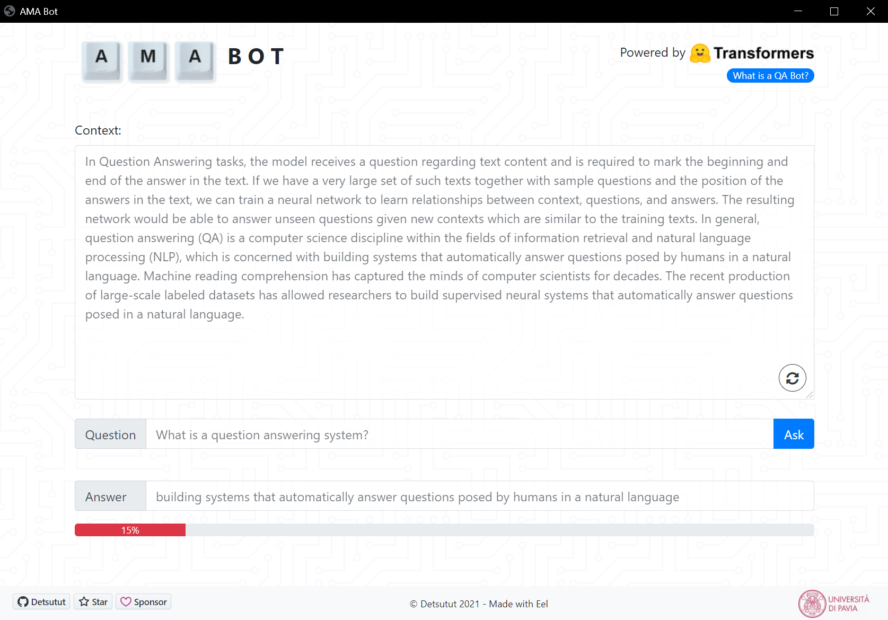

<div id="top"></div>

[![Contributors][contributors-shield]][contributors-url]
[![Forks][forks-shield]](https://github.com/detsutut/qa-webgui/network/members)
[![Stargazers][stars-shield]][stars-url]
[![Issues][issues-shield]][issues-url]
[![MIT License][license-shield]][license-url]
[![LinkedIn][linkedin-shield]][linkedin-url]

<br />
<div align="center">
  <h2>
     B O T
  </h2>

  <h3 align="center">AMA (Ask Me Anything) Bot</h3>

  <p align="center">
    A modern and lightweight NLP interface for Question-Answering<br/>Fork this project to showcase your Python models with elegant web application in no time!
    <br />
    <a href="https://github.com/detsutut/qa-webgui"><strong>Explore the docs »</strong></a>
    <br />
    <br />
    <a href="https://github.com/detsutut/qa-webgui/issues">Report Bug</a>
    ·
    <a href="https://github.com/detsutut/qa-webgui/issues">Request Feature</a>
  </p>
</div>


<!-- TABLE OF CONTENTS -->
<details>
  <summary>Table of Contents</summary>
  <ol>
    <li>
      <a href="#about-the-project">About The Project</a>
      <ul>
        <li><a href="#built-with">Built With</a></li>
      </ul>
    </li>
    <li>
      <a href="#getting-started">Getting Started</a>
      <ul>
        <li><a href="#prerequisites">Prerequisites</a></li>
        <li><a href="#installation">Installation</a></li>
      </ul>
    </li>
    <li><a href="#usage">Usage</a></li>
    <li><a href="#roadmap">Roadmap</a></li>
    <li><a href="#license">License</a></li>
    <li><a href="#contact">Contact</a></li>
    <li><a href="#acknowledgments">Acknowledgments</a></li>
  </ol>
</details>


<!-- ABOUT THE PROJECT -->
## About The Project

Python is one the trending programming languages to build and run Natural Language Processing pipelines. However, while programming a simple GUI framework is not much of a difficult task in Python, building a modern and nice interface can be a real nightmare, involving heavy external libraries and steep learning curves.

This projects aims to provide a simple environment to showcase Huggingface NLP Models internally with modern and well-designed user interfaces. By binding Python with HTML, CSS and Javascript with [Eel](https://github.com/ChrisKnott/Eel) (a little Python library for making simple Electron-like apps), this environment can be easily extended by those who are familiar with web design to build amazing web application within a few hours, with almost no additional effort.

With this aim in mind, I decided to implement a Qustion-Answering (QA) bot, called "Ask Me Anything (AMA) Bot" and based on [Deepset's RoBERTa implementation](https://huggingface.co/deepset/roberta-base-squad2) , hosted on Huggingface and trained on SQuAD 2.0 for extractive QA.




<p align="right">(<a href="#top">back to top</a>)</p>


### Built With

This project is mainly written in Python+Javascript and built with:

* [Huggingface Transformers](https://huggingface.co/transformers/) for the NLP pipeline
* [Eel](https://github.com/ChrisKnott/Eel) for the Python-Javascript binding
* [Bootstrap](https://getbootstrap.com) for front-end UI design

<p align="right">(<a href="#top">back to top</a>)</p>


<!-- GETTING STARTED -->
## Getting Started

To get a local copy of the AMA Bot up and running follow these simple example steps.

### Prerequisites

This project depends on two Python Modules that must be installed in your virtual environment before running the main script.
* huggingface transformers
  ```sh
  python -m pip install transformers
  ```
* eel
  ```sh
  python -m pip install eel
  ```
  
### Installation

1. Copy this repository 
2. Activate the virtual environment where Python Modules are installed
3. Run the main script
    ```sh
    python main.py
    ```
You can also create a runnable batch file on Windows. Check the `gui.bat` template provided and change the path to point to your target virtual environment.

<p align="right">(<a href="#top">back to top</a>)</p>


<!-- USAGE EXAMPLES -->
## Usage

The way extractive QA bots work is simple.

1) The user provides the context, which is usually a relatively long text that is supposed to include the answers to the user's questions.
2) The user formulates a question and press the ask button.
3) The model will scan the context and output its guess about the answer, which will be part of the context itself. The answer comes with a confidence core, which is an indicator of how reliable the model's prediction is.

<p align="right">(<a href="#top">back to top</a>)</p>


<!-- ROADMAP -->
## Roadmap

- [x] Basic implementation
- [x] Confidence Score
- [ ] Answer highlighting in context
- [ ] Uploading different checkpoint

See the [open issues](https://github.com/detsutut/qa-webgui/issues) for a full list of proposed features (and known issues).

<p align="right">(<a href="#top">back to top</a>)</p>


<!-- LICENSE -->
## License

Distributed under the GPL-3 License. See `LICENSE.txt` for more information.

<p align="right">(<a href="#top">back to top</a>)</p>


<!-- CONTACT -->
## Contact

Tommaso Mario Buonocore <br> [![LinkedIn][linkedin-shield]][linkedin-url]  [![Gmail][gmail-shield]][gmail-url]

Project Link: [https://github.com/detsutut/qa-webgui](https://github.com/detsutut/qa-webgui)

<p align="right">(<a href="#top">back to top</a>)</p>


<!-- ACKNOWLEDGMENTS -->
## Acknowledgments

Gratitude for support, assistance and inspiration goes to:

* [BMI Lab - University of Pavia](http://www.labmedinfo.org/index.php/en/10-2/)
* [Huggingface Forum](https://discuss.huggingface.co/)
* [Readme Template](https://github.com/othneildrew/Best-README-Template)

<p align="right">(<a href="#top">back to top</a>)</p>


<!-- MARKDOWN LINKS -->
[contributors-shield]: https://img.shields.io/github/contributors/detsutut/qa-webgui.svg?style=for-the-badge
[contributors-url]: https://github.com/detsutut/qa-webgui/graphs/contributors
[forks-shield]: https://img.shields.io/github/forks/detsutut/qa-webgui.svg?style=for-the-badge
[forks-url]: https://github.com/detsutut/qa-webgui/network/members
[stars-shield]: https://img.shields.io/github/stars/detsutut/qa-webgui.svg?style=for-the-badge
[stars-url]: https://github.com/detsutut/qa-webgui/stargazers
[issues-shield]: https://img.shields.io/github/issues/detsutut/qa-webgui.svg?style=for-the-badge
[issues-url]: https://github.com/detsutut/qa-webgui/issues
[license-shield]: https://img.shields.io/github/license/detsutut/qa-webgui.svg?style=for-the-badge
[license-url]: https://github.com/detsutut/qa-webgui/blob/master/LICENSE.txt
[linkedin-shield]: 	https://img.shields.io/badge/LinkedIn-0077B5?style=for-the-badge&logo=linkedin&logoColor=white
[linkedin-url]: https://linkedin.com/in/tbuonocore
[gmail-shield]: https://img.shields.io/badge/Gmail-D14836?style=for-the-badge&logo=gmail&logoColor=white
[gmail-url]: mailto:buonocore.tms@gmail.com
